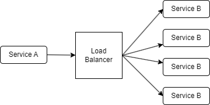
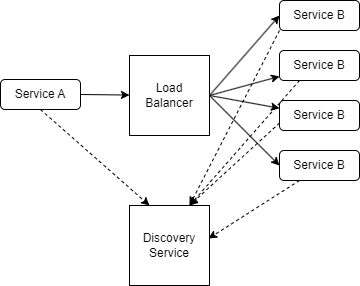
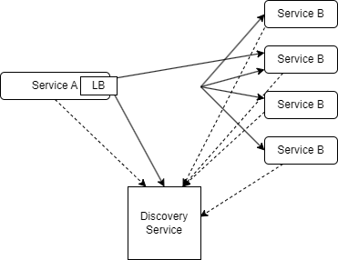

# Server side load balancer
Server side load balancers are the traditional load balancers. These are also known as the Front


# Problems with traditional(server side) load balancers
* 2 remote calls instead of one remote calls. Service A to Load Balancer server then Service B.
* Single point of failure. If the LB server goes down.
* Need manual configuration for keeping tracks of the servers.
* Need maintainance cost and team to maintain the LB server.
* Not scalable.
* Not container friendly.

Here comes the Discovery service

# Server side discovery



* Each servers are registered in the discovery service.
* When service A makes a request to the LB, the LB looks to the discovery server
* The discovery server has a key value pair which is called the registry. In key, it keeps the service name. In the value part, it keeps all the ip-addresses or urls in a list. The list contains the server's(key) running instances.
* We the LB gets the list, it forwards the service A's request to a less consumed instance of service B.
* This is a pattern which is called the 'server side discovery'.

# Client side discovery
If we don't use the Load balancer server, then the flow will act as a client side discovery pattern.

* service A requests directly to the discovery server.
* The discovery service will return all the available instances of the service
* A client side LB is managed in the service A. It will decide which instance to make request.



# Solution for 2 remote calls
Still we need to make 2 remote calls. First time, we get the list from the discovery service. Again if we need to call the service B, again we need 2 remote calls. We can avoid 2 remote calls using cache. If the service A keeps the service B's info in a cache, we can do it using one remote call.

# More improvements
* When a service starts, it will make a call to the discovery server, take the entire registry and caches it.

# Failure
If an instance goes down, the url of that instance still kept in the cache. In that case, the request from service A to the dead instance will fail.

# Libraries
client side discovery
* netflix eureka
* apache zookeeper
* consul

server side discovery
* nginx
* aws elb

# Note
* Load balancer and service discovery are 2 different things.
* In case a service can't reach to another service then it internally connect to the discovery service and update the cache.
* Api gateway and the service discovery are different things. Api gateway is used for remote calls from UI apps or other third party microservice calls. The api gateway has a LB. On the other hand service discovery is used for networking in a internal microservice.
* There can be multiple discovery service instances. They can follow the master-slave architecture or run parallaly(clustering).

# Create a new project for service discovery
* Go to the start.spring.io and select the Eureka discovery client. Extract and build the project.
* This Project will work as the discovery server.
* Add the @EnableEurekaServer
* We will see some errors.

At this moment, there is no instance registered with Eureka.

# Note
* Netflix influenced their services from AWS. One of them is the Region-zone. For example, us-east is a region. We can deploye our applications in different buildings/zones of a specific region. The names of the zones can be: us-east-1a, us-east-2b etc.
* We should add a eureka service with each zones.
* All the eureka server will connect with each other and sync them each other.
* This ensures no single point of failure.


# Fix the error
* Our discovery server tries to connect with the url (http://localhost:8761/), But it is not running.
* It is assuming there is another discovery service in that url. But no discovery service is running on that url.
* We have to tell the app that you are a discovery server right now.
* Also tell that don't fetch from another registry. In above image, each service registry communicates with each other. As there is no service discovery right now, tell the app not to search another one.
* Add some properties

```yaml
server:
  port: 8761
eureka:
  client:
    fetchRegistry: false
```
* Run the app and hit the discovery url. We will see the discovery service dashboard.
```bash
http://localhost:8761/
```

Now there will be no error in the debugger window.

The eureka server refresh each 30 seconds. Each time it make requests to other discovery servers if there is any updated registry.

# Note
This is the default behavior of the eureka server. When it starts it always assumes that there is another registry running in another port and it always tries to connect with that fictional port. The eureka server always do this in startup. And call after each 30s to sync up. Here are 2 things.

* In startup, the first if the eureka server can't find the http://localhost:8761/ endpoint, it throws an error
* After that when 30s passed, in the sync up time, if that http://localhost:8761/ endpoint is not available, then there is no error.

Here is a scenario,

```yaml
server:
  port: 8080
eureka:
  client:
    fetchRegistry: false
```

Using this config we will get the exception first time and also get the same error for each 30s. Because there is nothing in 8761.

# Unknow application registration
In the eureka dashboard, we will see that an unknown app is registered in the application registry. It is our that eureka server. It regiters itself as a eureka client.

We can give a name to our discovery service application so that instead of 'unknown', we can see that name in the dashboard.

```yaml
server:
  port: 8761
eureka:
  client:
    fetchRegistry: false
spring:
  application:
    name: discovery-service-app
```

Now we will see the 'discovery-service-app' instead of 'unknown' in the eureka dashboard.

Now we don't want to register this discovery-service-app in our registry. we need the 'eureka.client.registerWithEureka=false' in the application.yaml file

```yaml
server:
  port: 8761
eureka:
  client:
    fetchRegistry: false
    registerWithEureka: false
spring:
  application:
    name: discovery-service-app
```