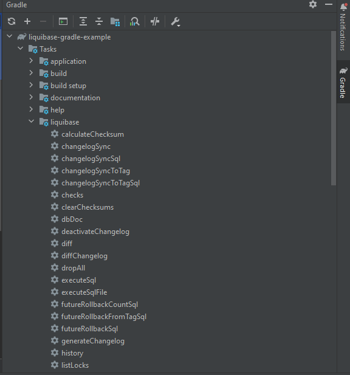

## Tools
* Gradle - Groovy
* Spring boot: 3.1.2
* Packaging: Jar
* Java: 17

* Liquibase Migration
* Lombok
* Spring Data JPA
* PostgreSQL Driver

## Put the JPA related code in application.yaml file
```yaml
spring:
  datasource:
    url: jdbc:postgresql://localhost/employee
    username: root
    password: root
  jpa:
    hibernate:
      ddl-auto: update
    show-sql: true
    properties:
      hibernate:
        format_sql: true
```

## Import liquibase plugin in the plugin section
```groovy
plugins {
    //Others
	id 'java'
	id 'org.springframework.boot' version '3.1.2'
	id 'io.spring.dependency-management' version '1.1.2'
	id 'org.liquibase.gradle' version '2.2.0'
	
    //liquibase plugin
	id 'org.liquibase.gradle' version '2.2.0'
}
```

## Check the left side gradle section in Intellij IDEA for avaiable liquibase commands


## Create the directory 'db/changelog' under resources folder if not exists
## Disable/Enable liquibase
Since we don't have any changelog file, we need to disable it in application.properties file if we run our application at this stage. The property is
```
spring.liquibase.enabled=false
```
In yaml file, please check the last 2 lines
```yaml
spring:
  datasource:
    url: jdbc:postgresql://localhost/employee
    username: root
    password: root
  jpa:
    hibernate:
      ddl-auto: update
    show-sql: true
    properties:
      hibernate:
        format_sql: true
  liquibase:
    enabled: false
```
## If we need to specify or change the default master path then
```
spring.liquibase.change-log
```
The default value is
```
classpath:/db/changelog/db.changelog-master.yaml
```
I want to use sql format, so I have to change it
```yaml
spring:
  datasource:
    url: jdbc:postgresql://localhost/employee
    username: root
    password: root
  jpa:
    hibernate:
      ddl-auto: update
    show-sql: true
    properties:
      hibernate:
        format_sql: true
  liquibase:
    enabled: true
    change-log: classpath:/db/changelog/db.changelog-master.sql
```

## Let's create the 'db.changelog-master.sql' file under '/resources/db/changelog' path
## Put this comment in the 'db.changelog-master.sql' file
```sql
-- liquibase formatted sql
```
Before running the project, we should enable liquibase and create the specified database. In this case the database name is employee.
```
spring.liquibase.enabled=true
```

## Define our first migration
```sql
-- liquibase formatted sql

-- changeset liquibase:1
create table employee(
    id int,
    name varchar(100),
    email varchar(100),
    primary key (id)
)
```
*Note: The line '-- changeset liquibase:1' is a must. Without this, liquibase will not create any table in the database.*

## Profile specific changes
* Move all contents from application.yaml to 2 different profiles. I've created applicaion-dev.yaml and application-prod.yaml.
* Modify application.yaml.
```yaml
spring:
  profiles:
    active: dev
  liquibase:
    enabled: true
    change-log: classpath:/db/changelog/db.changelog-master.sql
```
* In dev,
```yaml
spring:
  datasource:
    url: jdbc:postgresql://localhost/employee-dev
    username: root
    password: root
  jpa:
    hibernate:
      ddl-auto: update
    show-sql: true
    properties:
      hibernate:
        format_sql: true
```
* In prod,
```yaml
spring:
  datasource:
    url: jdbc:postgresql://localhost/employee-prod
    username: root
    password: root
  jpa:
    hibernate:
      ddl-auto: update
    show-sql: true
    properties:
      hibernate:
        format_sql: true
```
* Now first create those databases and then run the application, we can see in employee-dev database, the tables are created. On the other hand there are no tables in employee-prod database.
## Separate changelog files
* Change the master log file format to yaml in the application.yaml file.
* Create another changelist file. In this case, it is 'create-employee.sql'.
* Put those lines in create-employee.sql file.
```yaml
databaseChangeLog:
  - include:
      file: classpath:/db/changelog/create-employee.sql
```
* Put the liquibase content in the 'create-employee.sql' file
```sql
-- liquibase formatted sql

-- changeset create-employee:1
create table employee(
    id int,
    name varchar(100),
    email varchar(100),
    primary key (id)
)
```
## Add another changelog file
Liquibase runs changelogs in order. That's why I renamed the first file and create another file in order.
* changeset-000.sql
```sql
-- liquibase formatted sql

-- changeset create-employee:1
create table employee(
    id int,
    name varchar(100),
    email varchar(100),
    primary key (id)
)
```
* changeset-001.sql
```sql
-- liquibase formatted sql

-- changeset modify-employee:2
alter table employee add phone varchar(20)
```
## Work with JPA
Turn off the ddl-auto feature. Otherwise we can use 'validate'. Because other options will create JPA/Hibernate specific auto-generated tables in database.
```yaml
  jpa:
    hibernate:
      ddl-auto: none
```

## Define Entity
```java
@Entity
@Getter
@Setter
@NoArgsConstructor
public class Employee {
    @Id
    @GeneratedValue(strategy = GenerationType.IDENTITY)
    private int id;
    @Column
    private String name;
    @Column
    private String email;
    @Column
    private String phone;
}
```
Here I've used 'GenerationType.IDENTITY', because this option lets the database to generate the keys.
## Define Repository
```java
public interface EmployeeRepository extends JpaRepository<Employee, Integer> {
}
```
## Change the primary key type
As the database is responsible to generate the keys and the JPA providers aren't allowed to generate keys or tables, so we need to modify the changeset-000.sql file. The type should be serial instead of int for postgresql or auto increment for other databases.
```sql
-- liquibase formatted sql

-- changeset create-employee:1
create table employee(
    id serial,
    name varchar(100),
    email varchar(100),
    primary key (id)
)
```
*Note: As JPA providers are disabled, so the relationships(e.g: one to many), we should provide the relation tables as JPA providers are disabled to generate those*
## Insert some data
```java
@SpringBootApplication
public class LiquibaseGradleExampleApplication implements CommandLineRunner {

	public static void main(String[] args) {
		SpringApplication.run(LiquibaseGradleExampleApplication.class, args);
	}

	@Autowired
	EmployeeRepository employeeRepository;

	@Override
	public void run(String... args) throws Exception {
		var e1 = new Employee();
		e1.setName("leeon");
		e1.setEmail("leeon@mail.com");
		e1.setPhone("123");

		var e2 = new Employee();
		e2.setName("siam");
		e2.setEmail("siam@mail.com");
		e2.setPhone("567");

		employeeRepository.save(e1);
		employeeRepository.save(e2);

		employeeRepository
				.findAll()
				.forEach(employee -> System.out.println(employee.getName()));
	}

}
```