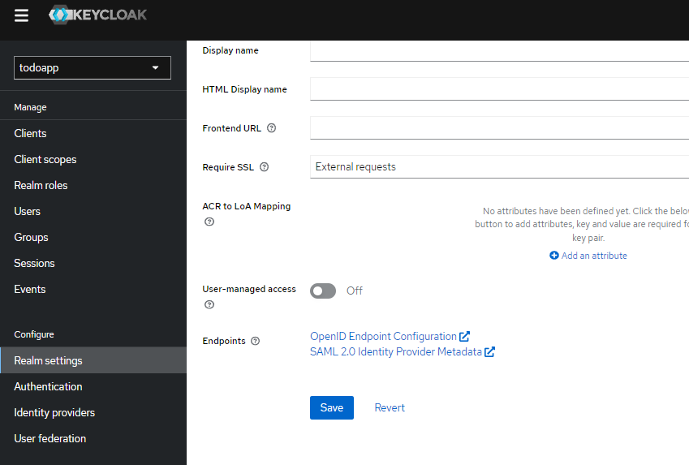
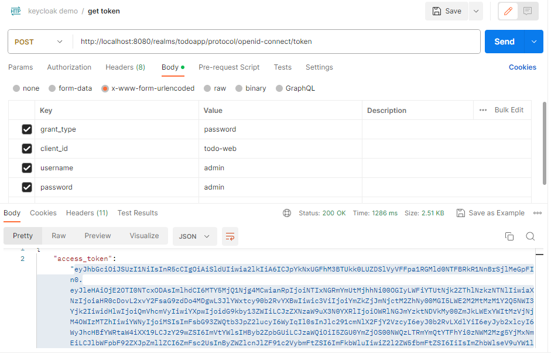
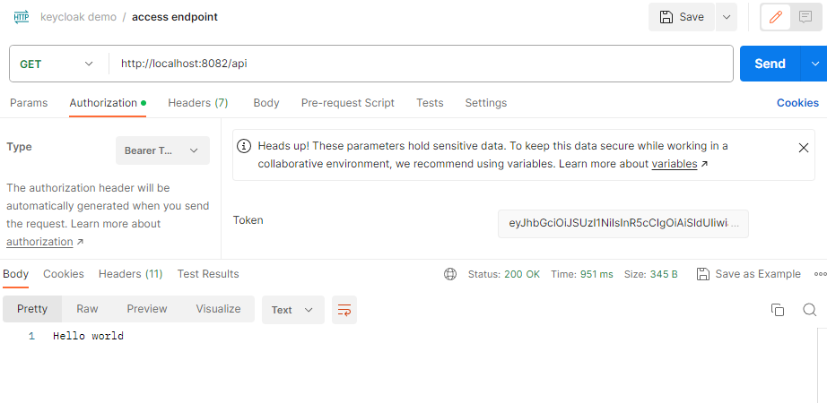

# Tools
* Gradle-groovy
* Spring boot - 3.1.2
* Java - 17

## Dependencies
* Spring web
* Lombok
* OAuth2.0 resource server

# Configure resource server in application.yaml file
```yaml
server:
  port: 8082

spring:
  security:
    oauth2:
      resourceserver:
        jwt:
          issuer-uri: http://localhost:8080/realms/todoapp
```
Here we get the issuer-uri from the Token Generator endpoint

In, keycloak admin console, Go to Realm settings -> General

Click Endpoints -> OpenID Endpoint Configuration



We can see those info in a json format.
```json
  "issuer": "http://localhost:8080/realms/todoapp",
  "authorization_endpoint": "http://localhost:8080/realms/todoapp/protocol/openid-connect/auth",
  "token_endpoint": "http://localhost:8080/realms/todoapp/protocol/openid-connect/token",
  "introspection_endpoint": "http://localhost:8080/realms/todoapp/protocol/openid-connect/token/introspect",
  "userinfo_endpoint": "http://localhost:8080/realms/todoapp/protocol/openid-connect/userinfo",
  "end_session_endpoint": "http://localhost:8080/realms/todoapp/protocol/openid-connect/logout",
```

Here is the token_endpoint.

# A simple controller
```java
@RestController
@RequestMapping("/api")
public class HomeController {
    @GetMapping
    public String hello() {
        return "Hello world";
    }
}
```

# Simple security configuration
```java
@Configuration
@EnableWebSecurity
public class SecurityConfig {

    @Bean
    public SecurityFilterChain securityFilterChain(HttpSecurity http) throws Exception {
        return http
                .csrf(AbstractHttpConfigurer::disable)
                .authorizeHttpRequests(auth -> auth.anyRequest().authenticated())
                .oauth2ResourceServer(rs -> rs.jwt(Customizer.withDefaults()))
                .sessionManagement(session -> session.sessionCreationPolicy(SessionCreationPolicy.STATELESS))
                .build();
    }
}
```
Here, I've configured each endpoints are authenticated, statless session and default jwt configuration.

# Run the app
At this stage, if we run the app, the app will run without any error. First, generate the token

Copy and paste the token_endpoint url, fill the form keys and values in the x-www-form-urlencoded. After sending the request, copy the token.



Go to authorizaiton tab. Select 'Bearer token' in type. Paste the token and send.


