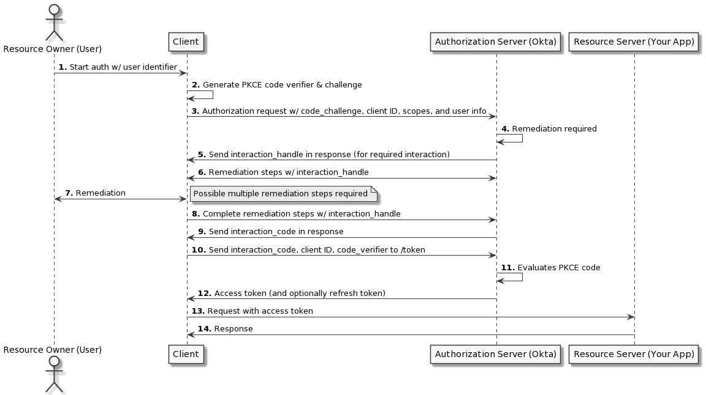
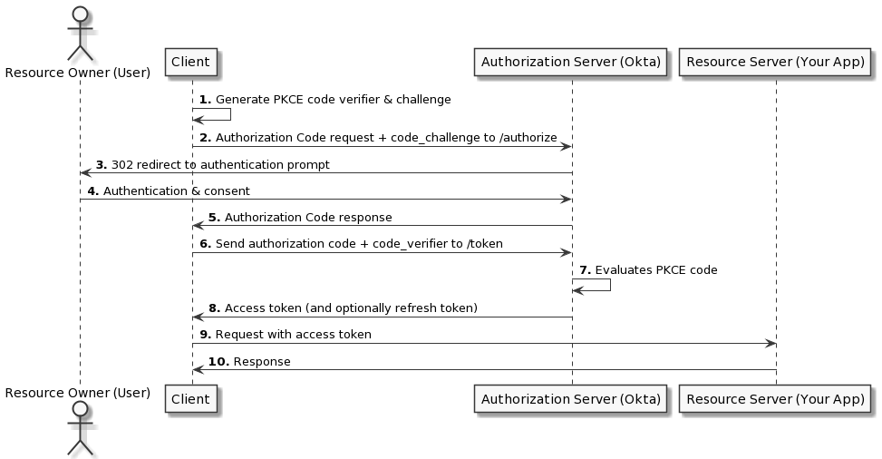
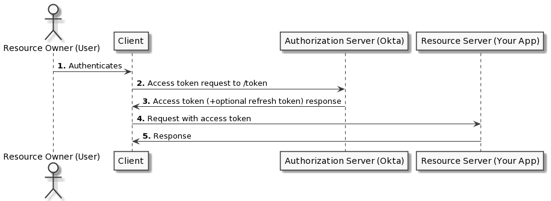
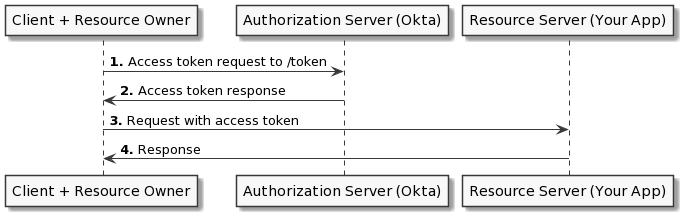
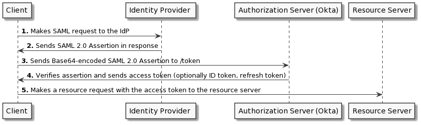

# OAuth 2.0 terminology
OAuth(Open Authorization) is an open protocol for secure authorization.

## Roles
* **Resource owner**: The user
* **Resource Server**: Where the user's secure resource are stored. Resource examples are files, photos etc. The resource server is also called as the API. The user must give access to some portion of their account of the resource server. The resource server must be able to accept and validate access tokens.
* **Authorization Server**: This can be the same as the resource server. This authorization server displays a prompt to the user for the approval or denies for the application request. This server is also responsible for granting access tokens after the user authorizes the application.
* **Client**: The application where the user first comes and it need the protected resource.
    * **Confidential client**: Can maintain the confidentiality of the client_secret. This clients are the web servers where the user can't access the source code.
    * **Public client**: Can't maintain the confidentiality of the client_secret. For example: mobile app, javascript app. The user can view the source code.

## Other terms
* **Access token**: Used for a authenticated request to the resource server/api. Using this a user can authorize a third party application to access their protected resources from outside of the application. The token has a corresponding duration of acccess, scope and other informations. The access token is a string.
* **Refresh token**: Used to get a new access token when the existing access token is expired.
* **Authorization code**: An intermidiate token used in the server-side app flow. An authorization code is returned to the client after a successful authorzation and then the client exchanges it for an access token.
* **Scope** The scopes are the specific tasks that the client can perform in a resource server on behalf of the resource owner(the user). For example, we can share a new post in facebook via the new app itself.

## Workflow/grant types
* Authorization code
* Implicit (depricated)
* Client credentials (depricated)
* Device code

## Application registration
For registering a client we need the following things
* Application name
* Application URL
* Redirect/callback URL - where the service will redirect after a successful or unsuccessful authorization.
* Client ID and Client Secret -
  Once the application is registered, the service will issue those. The client ID is a public thing and represents the applicaiton. This clident id is used to build the authorization URL.

## Workflow/grant types more detils
## Authorization code
### Step-1: Authorization code link
* The user is given an authrization code link like the following
  ```bash
  https://cloud.digitalocean.com/v1/oauth/authorize?response_type=code&client_id=CLIENT_ID&redirect_uri=CALLBACK_URL&scope=read
  ```
  This link contains the following
  * **Authorization endpoint**: https://cloud.digitalocean.com/v1/oauth/authorize
  * **response_type**: code indicates that this is a authorization code grant/flow.
  * **client_id**: The application ID. using this the api will identify the application.
  * **redirect_uri**: where the service will redirect after an authorization code is granted.
  * **scope**: specifying the level of access.
  * **state**: This allows us to store the previous state set by the client in the authorization request. This parameter mitigates the CSRF attack.

### Step-2: User authorizes the application
* When user click the link, a login promt will be appreared if the user isn't logged in. The user must log in to the service to authenticate the identity. Then the user will be prompted by the resource server to authorize the scope.
  
### Step-3: Application receives authorization code
* If the user authorzie the scope, then the auth server will redirect to the redirect_uri along with an authorization code. An example redirect uri is
  https://dropletbook.com/callback?code=AUTHORIZATION_CODE

### Step-4: The client/application requests an access token
* The client then requests an access token using the following details
  * client id
  * client secret
  * authorization code
  * redirect uri
  The request looks like this
  ```bash
  https://cloud.digitalocean.com/v1/oauth/token?client_id=CLIENT_ID&client_secret=CLIENT_SECRET&grant_type=authorization_code&code=AUTHORIZATION_CODE&redirect_uri=CALLBACK_URL
  ```

### Step-5: Client/application receives an access token
* If the authorization is valid, the authorization server will send a response along with access token and refresh token.
  ```json
  {
    "access_token":"ACCESS_TOKEN",
    "token_type":"bearer",
    "expires_in":2592000,
    "refresh_token":"REFRESH_TOKEN",
    "scope":"read",
    "uid":100101,
    "info": {
        "name":"Mark E. Mark",
        "email":"mark@thefunkybunch.com"
      }
    }
  ```

### Proof key for Code Exchange
If a public client is using the Authorization Code grant type then there is a possibility to intercept the authorization code. The Proof key for code exchange(PKCE or pixie) is an extension in this flow to mitigate this kind of attack. This is a cryptographycally random string. This is a base64 url encoded string of a sha-256 hash of the code verifier. So that the original random string is never exposed.
* First the client creates a random string called code verifier which is 43 to 128 characters long. It includes
  * A-Z
  * a-z
  * 0-9
  * -_.~
* The client creates the code challange by hashing the code verifier using code verifier hash method.
* The client sends this code challange and code challange creation method to the authorization endpoint with the same request.
Th request may look like this
  ```bash
  https://authorization-server.com/authorize
  ?client_id=eKNjzFFjH9A1ysYd
  &response_type=code
  &redirect_uri=com.example.app://auth
  &state=1234zyx
  &scope=photos
  &code_challenge=hKpKupTM381pE10yfQiorMxXarRKAHRhTfH_xkGf7U4
  &code_challenge_method=S256
  ```
* The auth server then sends a prompt to the user for authorization. If the user authorize then the auth server sends a authorization code to the redirect_uri. As the user sends the code challange and method, it stores those info.
* The client then send this authorization code along with the code challange and the code challange method to the auth server for an exchange of access token.
* Since the auth server records the code verifier it can easily verify it using the code challange and method.
* If the both code verifier matched(Before getting the authorization code and before the access token) then only the auth server will send the access token to the client.

## Client credentials flow
This flow is useful for machine to machine applicaions. A system authenticates and authorizes the applciation instead of a user.
* The client sends the client id and client secret for an access token to the auth server. 
* The auth server then verifies those and returns an access token.

## Refresh token flow
After an access token expires, if the user makes a request with the expired token, the resource server will send an invalid access token error. At this point, we can include the refersh token with the api request. We can get a fresh new access token then.
  ```bash
  https://cloud.digitalocean.com/v1/oauth/token?grant_type=refresh_token&client_id=CLIENT_ID&client_secret=CLIENT_SECRET&refresh_token=REFRESH_TOKEN
  ```
## Device code flow
Used in the limited input option devices where enter text is difficult like TV or video game console.
* The client(device app) makes a request to the authorization endpoint with the client ID. Usually makes the post request. The device authorization endpoint is different from the authorization server. Because the device authorization endpoint doesn't authenticate the device. Instead it returns a unique device code which is used to identify the device and a user code. With this device code the client makes a request to the authorization server. For example
  ```bash
  POST https://oauth.example.com/device

  client_id=CLIENT_id
  ```

* The authorization server responds with the following
  * device code
  * user code
  * verification uri
  * verification uri complete
  * expires in
  * For example,
  ```json
  {
    "device_code": "IO2RUI3SAH0IQuESHAEBAeYOO8UPAI",
    "user_code": "RSIK-KRAM",
    "verification_uri": "https://example.okta.com/device",
    "interval": 10,
    "expires_in": 1600
  }
  ```
* The user then accomplish the authorization using another machine which is easier to authenticate like laptop or pc or mobile. This can be done by one of the following
  * Visit the verification uri and enter the user code
  * Scan QR code or shorened URL embedded with user code generated from the verificaion uri complete
  * Directly navigating to the verfication page with embedded user code using verification uri complete, if running natively on a browser based device.
* The device app starts polling the authorization server for an access token using the time period specified by the interval. The device app continues polling until the user completes the browser flow path or code expires.
* When the user completes the browser flow path the auth server returns an access token and optionally a referesh token. The device app will forget the device code as it's expired now.
* The device app then use the access code to access resources.

## How to use the access token
Once the application has the access token, it can use the token to access the user's with the request's header like the following
  ```bash
  curl -X POST -H "Authorization: Bearer ACCESS_TOKEN""https://api.digitalocean.com/v2/$OBJECT"
  ```
## Oauth 2.0 and OIDC
### Interaction Code flow
  
### Authorizaiton code flow with PKCE
  
### Resource owner passwork flow
  
### Client credential flow
  
### SAML 2.0 assertion flow
  